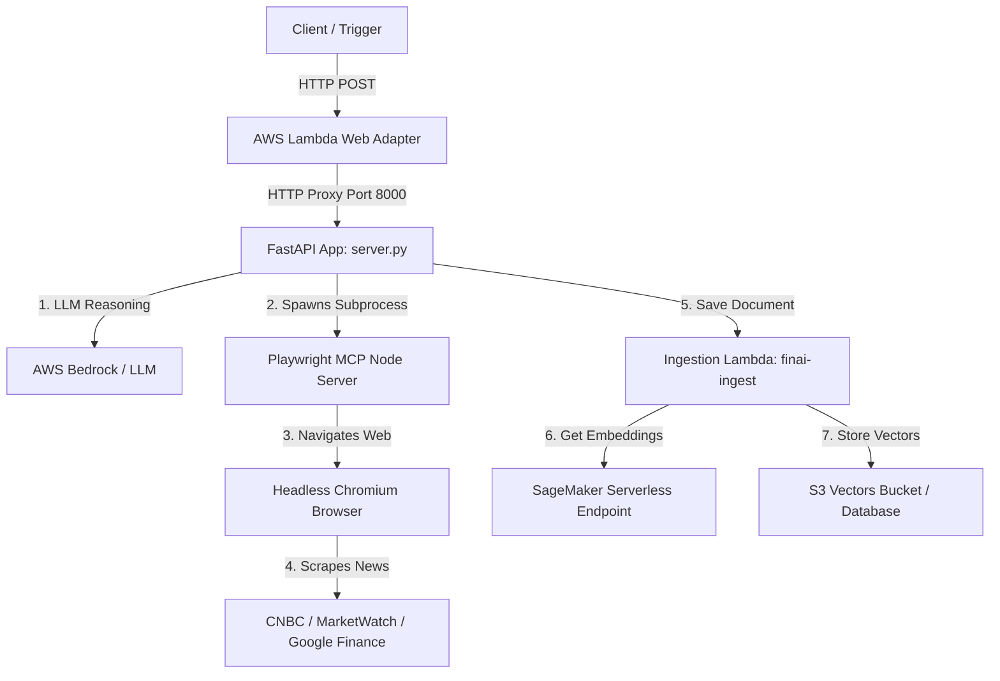

# FinAI Researcher Stack Deployment Guide

This guide is designed for absolute beginners to help configure, deploy, and tear down the FinAI Researcher Stack from a completely fresh machine. Follow the steps sequentially to set up your environment, authenticate with AWS, and provision the serverless infrastructure.

---

## 1. System Architecture

The following diagram illustrates how the components of the FinAI Researcher Stack interact when the researcher service is invoked:



---

## 2. Prerequisites: Environment Setup

Before building or deploying AWS infrastructure, you must install Python package management tools, Node.js, the AWS CLI, and Docker on your local computer.

### Step A: Install `uv` (Fast Python Package Manager)
`uv` is an extremely fast Python package installer and resolver. Install it based on your operating system:

* **Windows (PowerShell):** Open PowerShell and execute:
  ```powershell
  powershell -c "irm https://astral.sh/uv/install.ps1 | iex"
  ```
* **macOS (M-Series or Intel):** Open Terminal and execute:
  ```bash
  curl -LsSf https://astral.sh/uv/install.sh | sh
  ```
  Alternatively, if you use Homebrew:
  ```bash
  brew install uv
  ```
* **Linux / Ubuntu:** Open Terminal and execute:
  ```bash
  curl -LsSf https://astral.sh/uv/install.sh | sh
  ```

> [!NOTE]
> Restart your terminal window after installation to ensure the `uv` command is recognized in your path.

---

### Step B: Install Node.js & AWS CDK CLI
The AWS Cloud Development Kit (CDK) CLI is run via Node.js.

* **Windows:**
  1. Download the LTS Installer from the official [Node.js Website](https://nodejs.org/).
  2. Run the downloaded `.msi` file and follow the setup wizard (make sure to check the box to automatically install necessary tools).
  * Alternatively, using winget:
    ```powershell
    winget install OpenJS.NodeJS
    ```
* **macOS (M-Series / Intel):**
  * Using Homebrew:
    ```bash
    brew install node
    ```
  * Or download the macOS Installer (`.pkg`) from the official Node.js Website.
* **Linux / Ubuntu:** Run the following commands in your terminal:
  ```bash
  # Install NodeSource LTS Node.js repository
  curl -fsSL https://deb.nodesource.com/setup_lts.x | sudo -E bash -
  # Install nodejs
  sudo apt-get install -y nodejs
  ```

#### Install AWS CDK Globally:
Once Node.js and its package manager `npm` are installed, open a fresh terminal window and install the CDK command-line utility globally:
```bash
npm install -g aws-cdk
```

Verify the installation:
```bash
cdk --version
```

---

### Step C: Install Docker
Docker is required to build the Docker image for the Researcher Lambda locally before pushing it to AWS Elastic Container Registry (ECR).

* **Windows:**
  1. Download and run the installer for [Docker Desktop for Windows](https://www.docker.com/products/docker-desktop/).
  2. During installation, select **Use WSL 2 instead of Hyper-V** (highly recommended).
  3. Ensure you have WSL 2 enabled by running `wsl --install` in PowerShell.
  4. Start Docker Desktop and keep it running in the background.
* **macOS (M-Series users):**
  1. Download [Docker Desktop for Mac with Apple Silicon](https://www.docker.com/products/docker-desktop/).
  2. Drag the Docker application into your Applications folder and launch it.
* **macOS (Intel users):**
  1. Download [Docker Desktop for Mac with Intel chip](https://www.docker.com/products/docker-desktop/).
  2. Drag the application and launch it.
* **Linux / Ubuntu:** Run the following commands to install Docker Engine:
  ```bash
  sudo apt-get update
  sudo apt-get install -y ca-certificates curl gnupg
  sudo install -m 0755 -d /etc/apt/keyrings
  curl -fsSL https://download.docker.com/linux/ubuntu/gpg | sudo gpg --dearmor -o /etc/apt/keyrings/docker.gpg
  sudo chmod a+r /etc/apt/keyrings/docker.gpg

  echo "deb [arch=$(dpkg --print-architecture) signed-by=/etc/apt/keyrings/docker.gpg] https://download.docker.com/linux/ubuntu $(. /etc/os-release && echo "$VERSION_CODENAME") stable" | sudo tee /etc/apt/sources.list.d/docker.list > /dev/null

  sudo apt-get update
  sudo apt-get install -y docker-ce docker-ce-cli containerd.io docker-buildx-plugin docker-compose-plugin

  # Configure Docker daemon to run without sudo
  sudo usermod -aG docker $USER
  ```
  Log out and log back in to apply group changes, and verify with `docker ps`.

---

## 3. AWS CLI & Credentials Setup

You need the AWS command-line interface installed and configured with credentials that have administrator permissions to provision AWS resources.

### Step A: Install AWS CLI
* **Windows:** Open PowerShell and run the installer:
  ```powershell
  msiexec.exe /i https://awscli.amazonaws.com/AWSCLIV2.msi
  ```
  Or use winget:
  ```powershell
  winget install Amazon.AWSCLI
  ```
* **macOS:** Open Terminal and run:
  ```bash
  curl "https://awscli.amazonaws.com/AWSCLIV2.pkg" -o "AWSCLIV2.pkg"
  sudo installer -pkg AWSCLIV2.pkg -target /
  ```
* **Linux / Ubuntu:** Run:
  ```bash
  curl "https://awscli.amazonaws.com/awscli-exe-linux-x86_64.zip" -o "awscliv2.zip"
  unzip awscliv2.zip
  sudo ./aws/install
  ```

Verify:
```bash
aws --version
```

---

### Step B: Create AWS IAM Administrator Credentials
1. Log in to the [AWS Management Console](https://aws.amazon.com/console/) using your credentials.
2. Search for and navigate to the **IAM** (Identity and Access Management) console.
3. In the left navigation pane, choose **Users**, then click **Create user**.
4. Configure user details:
   * **User name:** `finai-cdk-deployer` (or any descriptive name).
   * Click **Next**.
5. Set permissions:
   * Select **Attach policies directly**.
   * In the search bar, search for **AdministratorAccess**.
   * Check the box next to **AdministratorAccess**.
   * Click **Next** and then **Create user**.
6. Generate Access Keys:
   * Find and click on your newly created user (`finai-cdk-deployer`) in the list.
   * Click the **Security credentials** tab.
   * Scroll down to the **Access keys** section and click **Create access key**.
   * Select **Command Line Interface (CLI)** as the use case.
   * Check the checkbox acknowledging the recommendation and click **Next**.
   * (Optional) Add a tag name, then click **Create access key**.
   
> [!IMPORTANT]
> Copy the **Access Key ID** and **Secret Access Key** or click **Download .csv file**. You will not be able to retrieve the Secret Access Key again once you navigate away from this screen.

---

### Step C: Configure AWS CLI
In your terminal or command prompt, run:
```bash
aws configure
```

You will be prompted for four pieces of information:
```text
AWS Access Key ID [None]: <Paste your Access Key ID>
AWS Secret Access Key [None]: <Paste your Secret Access Key>
Default region name [None]: us-east-1
Default output format [None]: json
```

Verify your setup runs properly by requesting account details:
```bash
aws sts get-caller-identity
```
You should see a JSON output showing your Account Number and IAM User ARN.

---

## 4. Project Directory Structure

Here is the directory structure layout for the FinAI Researcher Stack files. This layout organizes the infrastructure configuration files and the code components inside `backend/` directories:

```text
finai/
├── .env                  # Local environment file containing configuration variables
├── pyproject.toml        # Main Python project configuration and package requirements
├── uv.lock               # Dependency lockfile generated by uv
├── app.py                # Main CDK application orchestrator
├── cdk.json              # Configuration file directing CDK how to run the app
├── stacks/
│   └── researcher_stack.py # CDK file defining SageMaker, S3Vectors, and Lambda services
└── backend/
    ├── ingest/
    │   └── ingest_s3vectors.py # Python code containing Ingest Lambda functions
    └── researcher/
        ├── Dockerfile     # Docker instructions to assemble the researcher agent container
        ├── .dockerignore  # Ignores files from Docker build context
        ├── pyproject.toml # Dependencies required by the researcher agent in container
        ├── server.py      # Entrypoint script for Researcher Lambda container execution
        ├── tools.py       # Tool execution routines utilized by researcher
        ├── mcp_servers.py # Model Context Protocol server configuration
        └── context.py     # Custom context provider definitions
```

---

## 5. Bootstrapping AWS CDK

Before you can deploy any CDK applications to your AWS account, you must bootstrap your environment. This creates resources (like an S3 bucket for assets, and IAM roles) that CDK uses during execution.

1. Retrieve your AWS Account ID:
   ```bash
   aws sts get-caller-identity --query Account --output text
   ```
2. Bootstrap CDK (replace `<ACCOUNT-ID>` with your account number, and `<REGION>` with your chosen region, e.g., `us-east-1`):
   ```bash
   cdk bootstrap aws://<ACCOUNT-ID>/<REGION>
   ```

Example command execution:
```bash
cdk bootstrap aws://123456789012/us-east-1
```

---

## 6. Deploying the Researcher Stack

With all tools installed, Docker active, and CLI configurations set, you are ready to deploy.

### Step 1: Initialize Python Virtual Environment & Install Dependencies
From the root directory (`finai/`), set up your python workspace using `uv`:
```bash
# Sync workspace environment dependencies using uv
uv sync
```

### Step 2: Configure Environment Variables
Create a file named `.env` in the root of the project (`finai/`) if it does not already exist, and customize configurations such as your AWS account details and Bedrock models:

```env
# AWS Account Settings
AWS_ACCOUNT_ID=123456789012
DEFAULT_AWS_REGION=us-east-1

# Researcher Stack Configuration
INGEST_LAMBDA_NAME=finai-ingest
BEDROCK_REGION=us-east-1
RESEARCHER_MODEL=bedrock/moonshotai.kimi-k2.5

# SageMaker Embedding Config
EMBEDDING_MODEL_NAME=sentence-transformers/all-MiniLM-L6-v2

# Langfuse Observability Config (Optional)
LANGFUSE_PUBLIC_KEY=pk-lf-xxxx...
LANGFUSE_SECRET_KEY=sk-lf-xxxx...
LANGFUSE_HOST=https://cloud.langfuse.com
```

### Step 3: Start Docker Daemon
Make sure Docker Desktop is open and active on your machine (or that the Docker service is running on Linux). CDK requires the Docker daemon to build the docker image located at `backend/researcher/`.

### Step 4: Run the CDK Deploy Command
To synthesize and deploy only the Researcher Stack, run:
```bash
cdk deploy FinaiResearcherStack
```

#### What this command does:
1. Loads environment variables from `.env`.
2. Synthesizes AWS CloudFormation templates based on `researcher_stack.py`.
3. Spins up a local Docker container to build the image located in `backend/researcher/`.
4. Pushes the built Docker image to an automatically generated Amazon ECR repository.
5. Deploys the SageMaker model, serverless endpoint, S3 vector database bucket, indexes, and Lambdas.

#### Successful Deployment Output:
At the end of the deployment, CDK will output the generated resources, including the public endpoint URL:
```text
Outputs:
FinaiResearcherStack.ResearcherFunctionUrl = https://xxxxxxxxxxxxxx.lambda-url.us-east-1.on.aws/
FinaiResearcherStack.SageMakerEndpointName = finai-embedding-endpoint
FinaiResearcherStack.VectorsBucketName = finai-vectors-123456789012
```

Use the `ResearcherFunctionUrl` outputted in the CLI to trigger your agent.

---

## 7. Destroying the Researcher Stack

To avoid incurring charges on AWS for running services (such as SageMaker inference endpoints or S3 vector storage), destroy the stack once you are done using it.

Run the following command from the project root:
```bash
cdk destroy FinaiResearcherStack
```

Confirm the tear-down by typing `y` and pressing Enter when prompted:
```text
Are you sure you want to delete: FinaiResearcherStack (y/n)? y
```

This will safely remove:
* The SageMaker Serverless Inference Endpoint & Model configuration.
* The Ingestion Lambda and the Docker-based Researcher Lambda.
* Function URLs and associated IAM Roles created specifically for the stack.

*(Note: S3 buckets and log groups might be retained depending on your CDK stack removal policy settings).*
