# FinAI — Multi-Agent Wealth Management System (CDK Deployment)
=============================================================

FinAI is a serverless, agentic wealth management application designed to analyze, tag, and project retirement readiness for Indian retail investor portfolios. It operates on a multi-agent framework to evaluate allocations (asset class, region, sector), update live stock prices, perform Monte Carlo retirement readiness simulations, and scrape the web for real-time market research (such as TCS financial data) to index semantic knowledge.

---

## 📈 Business Use Case
Retail investors in India struggle to manage complex, diversified assets across multiple accounts (e.g., Demat stock accounts, EPF/PPF, NPS, mutual funds). Standard advisory portals either lack automated insight or are expensive. 

FinAI solves this by providing:
*   **Unified Account Aggregation**: Aggregates Demat accounts, EPF/PPF, and NPS balances.
*   **Agentic Portfolio Orchestration**: A Planner agent coordinates a team of focused sub-agents (Reporter, Charter, Retirement) to evaluate diversification, identify gaps, and generate Monte Carlo retirement readiness curves.
*   **Automatic Allocations Classifier**: An LLM-based Tagger automatically classifies new or untagged Indian symbols by sector, region, and asset class.
*   **Semantic Market Research Database**: A scraper-agent crawls live financial sites (e.g. Yahoo Finance) using browser automation, summarizes trending news, and indexes vectorized context into an S3-based Vector Database to enrich subsequent investment recommendations.

---

## 🛠️ Technical Stack
*   **Frontend**: Streamlit (Python-based interactive UI) packaged in a Docker container and deployed to **AWS ECS / Fargate** behind an Application Load Balancer.
*   **Backend API**: FastAPI running serverless on **AWS Lambda** via Mangum and exposed through **AWS API Gateway (HTTP API)**.
*   **Orchestration & Agents**: Built with standard python looping structures orchestrating focused agent lambdas via the `boto3` SDK.
*   **LLM Model & Provider**: Amazon Bedrock invoking Moonshot Kimi (`moonshotai.kimi-k2.5`) for core analytical and formatting tasks.
*   **Database**: PostgreSQL hosted on **AWS Aurora Serverless v2 PostgreSQL**, using AWS Secrets Manager for secure credential storage and accessed via the HTTP-based **RDS Data API**.
*   **Vector Search Database**: Amazon **S3 Vectors Index** storing embeddings generated via **Amazon SageMaker Serverless Inference** (`sentence-transformers/all-MiniLM-L6-v2`).
*   **Global Delivery & Routing**: **AWS CloudFront** serves as a unified HTTPS CDN routing frontend load-balancer traffic and `/api/*` REST API requests.
*   **Observability**: **Langfuse** logs all LiteLLM calls, token usage, latency, and costs grouped by `job_id`.

---

## 🔍 System Architecture & Interactive Flows

### 1. Unified Architecture Diagram

```mermaid
flowchart TD
    %% Styling and Palettes
    classDef client fill:#3b82f6,stroke:#1d4ed8,stroke-width:2px,color:#fff;
    classDef server fill:#8b5cf6,stroke:#6d28d9,stroke-width:2px,color:#fff;
    classDef db fill:#06b6d4,stroke:#0891b2,stroke-width:2px,color:#fff;
    classDef aws fill:#f97316,stroke:#ea580c,stroke-width:2px,color:#fff;
    classDef tool fill:#10b981,stroke:#047857,stroke-width:2px,color:#fff;
    
    %% LAYER 1: CLIENT FRONTEND
    subgraph ClientLayer ["1. Client Access Layer"]
        CF["AWS CloudFront CDN"]:::aws
        ALB["Application Load Balancer (ALB)"]:::aws
        Streamlit["Streamlit UI (ECS Fargate Container)"]:::client
    end

    %% LAYER 2: ROUTING & API
    subgraph APILayer ["2. Routing & API Gateway Layer"]
        FastAPI["FastAPI Backend Lambda (Mangum Adapter)"]:::server
        SQS["AWS SQS Queue (finai-analysis-jobs)"]:::aws
    end

    %% LAYER 3: AGENTS
    subgraph AgentOrchestration ["3. Multi-Agent Orchestration Stack"]
        LambdaPlanner["finai-planner Lambda (Orchestrator)"]:::server
        LiteLLM["LiteLLM Integration"]:::tool
        Bedrock["Amazon Bedrock (Kimi K2.5 LLM)"]:::aws
        
        subgraph SubAgents ["Sub-Agents"]
            LambdaTagger["finai-tagger Lambda"]:::aws
            LambdaReporter["finai-reporter Lambda"]:::aws
            LambdaCharter["finai-charter Lambda"]:::aws
            LambdaRetirement["finai-retirement Lambda"]:::aws
        end
    end

    %% LAYER 4: DATABASE & STORAGE
    subgraph StorageLayer ["4. Persistent Storage Layer"]
        Aurora["Aurora Serverless PostgreSQL (RDS Data API)"]:::db
        SM_Creds["AWS Secrets Manager"]:::aws
    end

    %% LAYER 5: RESEARCH & INGESTION
    subgraph ResearcherStack ["5. Web Scraping & Vector DB Stack"]
        LambdaResearcher["finai-researcher Docker Lambda (LWA)"]:::server
        Playwright["Playwright MCP Node Server (FastAPI Interface)"]:::tool
        LambdaIngest["finai-ingest Lambda"]:::aws
        SageMaker["SageMaker Serverless (all-MiniLM-L6-v2)"]:::aws
        S3Vectors["Amazon S3 Vector Storage Index"]:::db
    end

    %% LAYER 6: TELEMETRY
    subgraph ObservabilityLayer ["6. Observability Layer"]
        Langfuse["Langfuse Telemetry Cloud"]:::tool
    end

    %% --- CONNECTIONS WITH STEP NUMBERS & PROPER SPACING ---
    
    %% FLOW A: USER ACCESS & DATABASE OPERATIONS
    User((User Browser)) ==>|1. Access URL| CF
    CF ==>|2. Default routing| ALB
    ALB ==>|3. Forward WebSockets| Streamlit
    Streamlit ==>|4. REST Calls to /api/*| CF
    CF ==>|5. Route API path| FastAPI
    FastAPI ==>|6. Retrieve Secret| SM_Creds
    FastAPI ==>|7. RDS Data API| Aurora

    %% FLOW B: ASYNCHRONOUS PORTFOLIO ANALYSIS ORCHESTRATION
    Streamlit -->|8. Request analysis run| CF
    FastAPI -->|9. Push execution job payload| SQS
    SQS -->|10. Trigger execution| LambdaPlanner
    
    LambdaPlanner -->|11. Manage task workflow| Aurora
    LambdaPlanner -->|12. Call model via LiteLLM| Bedrock
    
    LambdaPlanner -->|13a. Call symbol tagger| LambdaTagger
    LambdaPlanner -->|13b. Call reporter| LambdaReporter
    LambdaPlanner -->|13c. Call charter| LambdaCharter
    LambdaPlanner -->|13d. Call retirement mc| LambdaRetirement
    
    SubAgents -->|14. Write agent evaluation results| Aurora

    %% FLOW C: LIVE WEB RESEARCH & SEMANTIC INGESTION
    Streamlit -.->|15. Trigger research query| LambdaResearcher
    LambdaResearcher -->|16. Execute FastAPI route| Playwright
    Playwright -->|17. Scrape Yahoo Finance data| LambdaResearcher
    LambdaResearcher -->|18. Call Summarizer LLM| Bedrock
    LambdaResearcher -->|19. Trigger ingestion payload| LambdaIngest
    LambdaIngest -->|20. Fetch embeddings| SageMaker
    LambdaIngest -->|21. Index vector & text metadata| S3Vectors

    %% FLOW D: TELEMETRY & OBSERVABILITY TRACING
    LiteLLM -.->|22. Send prompt/response telemetry| Langfuse
    LambdaResearcher -.->|23. Trace researcher spans| Langfuse
    LambdaPlanner -.->|24. Trace planner loops| Langfuse
```



### 2. Detailed System Flows

#### Flow A: UI Operations & Relational Storage
1. The user opens the web application via the **AWS CloudFront** secure HTTPS domain.
2. CloudFront routes standard web requests through the **Application Load Balancer (ALB)**, which upgrades connections to persistent WebSockets (with a 30-minute connection idle timeout to prevent disconnection drops) and routes requests to the **Streamlit UI** running containerized inside **AWS ECS / Fargate**.
3. Streamlit uses standard REST calls to talk to the backend. These calls are directed to CloudFront, which routes `/api/*` requests directly to our serverless **FastAPI Backend Lambda** using a Mangum adapter.
4. FastAPI pulls database connection parameters from **AWS Secrets Manager** and processes transaction requests against **AWS Aurora Serverless PostgreSQL** via the HTTP-based **RDS Data API**.
5. When adding a position to a Demat stock account, FastAPI dynamically queries the current price, calculates `price * quantity`, and performs validation against the account's available cash balance to block the trade with an `HTTPException(400)` if funds are insufficient.

#### Flow B: Asynchronous Agentic Portfolio Analysis
1. When a user requests portfolio analysis, Streamlit sends a POST request to `/api/analyze`.
2. The FastAPI backend creates a job record in PostgreSQL and pushes the job payload containing the unique `job_id` to the **AWS SQS Queue** (`finai-analysis-jobs`).
3. SQS triggers the **`finai-planner` Lambda** orchestrator function.
4. The `finai-planner` evaluates the user portfolio allocations and orchestrates analytical sub-agents by invoking focused AWS Lambda functions:
   - **`finai-tagger`**: Resolves sector, regional exposure, and asset category for any untagged symbols.
   - **`finai-reporter`**: Generates structured Markdown analyses.
   - **`finai-charter`**: Assembles chart configurations.
   - **`finai-retirement`**: Runs Monte Carlo models to map retirement readiness.
5. All sub-agents write their evaluation artifacts back to PostgreSQL.

#### Flow C: Browser Automation Scraping & Semantic Vector Ingestion
1. The user requests live equity research (e.g. Yahoo Finance scraping) in the Streamlit UI, triggering a request to the **`finai-researcher` Lambda**.
2. **FastAPI & Playwright Docker Setup**:
   - The `finai-researcher` service is containerized inside a Docker image containing node.js and a globally installed **Playwright MCP (Model Context Protocol)** server alongside Chromium.
   - It incorporates the **AWS Lambda Web Adapter (LWA)**, allowing standard Lambda invocations to proxy HTTP requests directly to a local Python `uvicorn` instance serving a FastAPI app (`server.py`).
   - The FastAPI app executes browser commands, crawls Yahoo Finance using Playwright automation, extracts news or metrics, and processes a summary via Bedrock.
3. The researcher sends the textual data to the **`finai-ingest` Lambda**.
4. `finai-ingest` triggers an **Amazon SageMaker Serverless Inference** endpoint running `sentence-transformers/all-MiniLM-L6-v2` to obtain a 384-dimensional vector embedding.
5. Ingest updates the vector index, storing the resulting semantic index and text details within **Amazon S3 Vector Storage**.

#### Flow D: Telemetry & Tracing
1. LiteLLM callback intercepts Bedrock LLM prompts/responses across all agents and routes telemetry to the **Langfuse US Cloud** dashboard.
2. Because all sub-agents inherit the same `trace_id` (the parent `job_id`), Langfuse automatically groups all independent agent executions (Planner, Reporter, Charter, Retirement) into a single, unified execution trace tree.

---

## 🏗️ CDK Infrastructure Stacks Deep Dive

The architecture is divided into three distinct CloudFormation Stacks defined in the `stacks/` directory:

### Stack 1: Database & Agent Orchestration (`DatabaseAgentsStack`)
*   **CDK Logical Name**: `FinaiDatabaseAgentsStack`
*   **Primary Responsibility**: Deploys the application's database backend and AI execution sub-agents.
*   **Core Resources**:
    *   **Aurora Serverless v2 Cluster**: Runs Postgres engine v16. Allows the database capacity to automatically scale down to 0.5 ACU during idle times and scale up to 2 ACUs when processing heavy queries.
    *   **AWS Secrets Manager**: Automatically generates secure database credentials and database encryption keys.
    *   **AWS SQS Queue (`finai-analysis-jobs`)**: decouples API requests from agent execution. API backend publishes to SQS, which invokes the Planner Lambda function.
    *   **Docker-based sub-agents**: Planner, Tagger, Reporter, Charter, and Retirement are packaged as container images to support complex libraries without hitting Lambda's 250MB limit.

### Stack 2: Web Scraping & Semantic Search (`ResearcherStack`)
*   **CDK Logical Name**: `FinaiResearcherStack`
*   **Primary Responsibility**: Collects equity news data and maintains vectorized knowledge context.
*   **Core Resources**:
    *   **Playwright Docker Lambda (`finai-researcher`)**: Uses Node/Chromium inside Lambda with Lambda Web Adapter (LWA) to crawl pages, summarize findings using Bedrock, and write news context.
    *   **SageMaker Serverless Inference Endpoint**: Hosts `sentence-transformers/all-MiniLM-L6-v2` to convert text queries into 384-dimensional embeddings.
    *   **S3 Vector Database Bucket**: Stores embeddings index context files directly on S3 to create a low-cost, serverless vector retrieval network.
    *   **EventBridge Rule**: Runs on a daily cron schedule to trigger Yahoo news scraping automatically.

### Stack 3: Frontend Hosting & API Routing (`FrontendStack`)
*   **CDK Logical Name**: `FinaiFrontendStack`
*   **Primary Responsibility**: Handles user logins, serves the Streamlit UI dashboard, and exposes the HTTP API.
*   **Core Resources**:
    *   **Cognito User Pool**: Houses user directory credentials. Utilizes a PreSignUp trigger Lambda to auto-confirm user emails.
    *   **ECS Fargate Service**: Hosts the Streamlit frontend container behind an Application Load Balancer (ALB). Features a 30-minute WebSocket connection timeout.
    *   **FastAPI API Lambda (`finai-api`)**: Serves the REST API using a Mangum wrapper.
    *   **AWS API Gateway**: Exposes API endpoints under a serverless gateway configuration.
    *   **CloudFront CDN Distribution**: Serves as a single domain fronting both frontend Streamlit and backend API endpoints, eliminating CORS issues entirely.

---

## ⚙️ Environment Variables Configuration

The application reads configuration parameters from a `.env` file located in the `finai-agent` directory. Below is a detailed reference of the required and optional environment variables:

| Variable | Description | Default / Example |
| :--- | :--- | :--- |
| **AWS Settings** | | |
| `AWS_ACCOUNT_ID` | Your AWS Account ID. | `905418342208` |
| `DEFAULT_AWS_REGION` | The default target AWS region for CDK deployment and AWS resource invocation. | `us-east-1` |
| **LLM & Bedrock** | | |
| `BEDROCK_MODEL_ID` | The Bedrock foundational LLM model identifier used for analysis tasks. | `moonshotai.kimi-k2.5` |
| `BEDROCK_REGION` | The AWS region where Bedrock models are hosted. | `us-west-2` |
| **Researcher Stack** | | |
| `INGEST_LAMBDA_NAME` | The physical name of the vector ingest AWS Lambda function. | `finai-ingest` |
| `RESEARCHER_MODEL` | The LiteLLM model identifier used by the scraping researcher agent. | `bedrock/moonshotai.kimi-k2.5` |
| `EMBEDDING_MODEL_NAME` | The pre-trained sentence transformer model used for vector embeddings. | `sentence-transformers/all-MiniLM-L6-v2` |
| **Observability** | | |
| `LANGFUSE_PUBLIC_KEY` | Public API key for Langfuse LLM monitoring and tracing. | `pk-lf-...` |
| `LANGFUSE_SECRET_KEY` | Secret API key for Langfuse LLM monitoring and tracing. | `sk-lf-...` |
| `LANGFUSE_HOST` | The URL of your Langfuse endpoint (US Cloud or EU Cloud). | `https://us.cloud.langfuse.com` |
| **Database & SQS** | | |
| `AURORA_CLUSTER_ARN` | The ARN of the Aurora Serverless DB cluster (required for migrations and local scripts). | *Derived after Stack 1* |
| `AURORA_SECRET_ARN` | The Secrets Manager Secret ARN holding DB credentials. | *Derived after Stack 1* |
| `AURORA_DATABASE` | PostgreSQL database name. | `finai` |
| `SQS_QUEUE_URL` | SQS queue endpoint URL for async task queuing. | *Derived after Stack 1 (Prod)* |
| **Local Dev Flags** | | |
| `MOCK_AUTH` | Skip AWS Cognito JWT token validation (for testing/developing endpoints locally). | `true` / `false` |
| `MOCK_LAMBDAS` | Execute agent workflows (Reporter, Charter, Retirement) locally inside the Python process instead of invoking AWS Lambdas. | `true` / `false` |

---

## 💻 Local Development & Testing Guide

To facilitate developer productivity and test code changes without repeatedly deploying resources to AWS, FinAI provides mock and local execution modes.

### 1. Enable Mock Authentication (`MOCK_AUTH=true`)
By setting `MOCK_AUTH=true` in your `.env` file, the FastAPI server skips remote Cognito signature checks. It will accept any mock bearer token (e.g. `Bearer test_user_001`) and map request headers to a placeholder user profile in the database, allowing you to debug APIs instantly.

### 2. Enable Local Agent Execution (`MOCK_LAMBDAS=true`)
When `MOCK_LAMBDAS=true` is set:
- The Planner orchestrator imports and runs sub-agent handlers (Reporter, Charter, Retirement) directly within the same local process instead of invoking deployed AWS Lambda functions.
- To execute the API and agent loops on your local machine:
  1. Boot the FastAPI server locally:
     ```bash
     python backend/api/main.py
     ```
  2. Launch the Streamlit frontend locally:
     ```bash
     streamlit run frontend/app.py
     ```
  This creates a completely self-contained local feedback loop!

---

## 🚀 Step-by-Step Production Deployment Guide

### Prerequisites
1.  **AWS Account**: An AWS account with the AWS CLI configured (`aws configure`).
2.  **NodeJS & CDK**: Ensure Node.js is installed to run CDK commands.
3.  **Docker**: Required to compile ECR container assets for the Researcher and Streamlit frontend.
4.  **UV Python Manager**: `uv` is used for packaging backend lambda zip files and running local scripts.

---

### Step 1: Package the FastAPI Lambda Code
Compile the FastAPI dependencies and sources into the Lambda-ready deployment package:
```bash
python scripts/build_api_zip.py
```
*   This automatically downloads and bundles the Linux x86_64 native wheels (`pydantic-core`, `cryptography`) into `backend/api/api_lambda.zip`.

---

### Step 2: Bootstrap & Deploy the CloudFormation Stacks
> [!IMPORTANT]
> **CDK Deployment Sequencing Rule**
> The `FinaiFrontendStack` reads database configuration variables (`AURORA_CLUSTER_ARN` and `AURORA_SECRET_ARN`) from your local `.env` environment at template synthesis time. 
> 
> If you deploy all stacks concurrently using `cdk deploy --all` on a fresh environment, the database resource ARNs do not exist yet. As a result, the template compiles using the fallback `-dummy` secret string, causing API errors at runtime.
> 
> **You must deploy the stacks step-by-step in the following sequence:**

1.  **Deploy SageMaker embeddings and Web scraping tools**:
    ```bash
    npx cdk deploy FinaiResearcherStack --require-approval never
    ```

2.  **Deploy Database and Agent compute resources**:
    ```bash
    npx cdk deploy FinaiDatabaseAgentsStack --require-approval never
    ```

3.  **Update your local environment configurations**:
    Copy the outputs from the terminal completion screen of the `FinaiDatabaseAgentsStack` (`AuroraClusterArn` and `AuroraSecretArn`) and add them to your local `.env` file in the `finai-agent/` directory:
    ```env
    AURORA_CLUSTER_ARN="arn:aws:rds:us-east-1:123456789012:cluster:finai-aurora-cluster"
    AURORA_SECRET_ARN="arn:aws:secretsmanager:us-east-1:123456789012:secret:finai-aurora-credentials-..."
    ```

4.  **Deploy the frontend user portal and API Gateway routing**:
    *Once the `.env` file is updated*, run the deployment for the frontend layer so that CDK compiles the correct database values into the API Lambda's configuration:
    ```bash
    npx cdk deploy FinaiFrontendStack --require-approval never
    ```


---

### Step 3: Run Database Migrations
Create tables, triggers, indices, and database helper functions in the Aurora Serverless PostgreSQL cluster.

Before running the migration, you must supply the database cluster and credentials secret ARNs (which were outputted by the CDK deployment in **Step 2**):
*   `AURORA_CLUSTER_ARN` (the `AuroraClusterArn` output)
*   `AURORA_SECRET_ARN` (the `AuroraSecretArn` output)

You can configure these variables in one of two ways:

#### Option A: Save to your local `.env` file
Add the values to the `.env` file in the `finai-agent/` directory:
```env
AURORA_CLUSTER_ARN="arn:aws:rds:us-east-1:123456789012:cluster:finai-aurora-cluster"
AURORA_SECRET_ARN="arn:aws:secretsmanager:us-east-1:123456789012:secret:finai-aurora-credentials-..."
```

#### Option B: Export them directly in your terminal shell
**Bash / macOS / Linux:**
```bash
export AURORA_CLUSTER_ARN="arn:aws:rds:us-east-1:123456789012:cluster:finai-aurora-cluster"
export AURORA_SECRET_ARN="arn:aws:secretsmanager:us-east-1:123456789012:secret:finai-aurora-credentials-..."
```

**PowerShell (Windows):**
```powershell
$env:AURORA_CLUSTER_ARN="arn:aws:rds:us-east-1:123456789012:cluster:finai-aurora-cluster"
$env:AURORA_SECRET_ARN="arn:aws:secretsmanager:us-east-1:123456789012:secret:finai-aurora-credentials-..."
```

Once the environment variables are set, run the migration runner:
```bash
uv run backend/database/run_migrations.py
```


---

### Step 4: Seed Initial Allocations Data
Populate the PostgreSQL instance with allocation mappings (sector, region, asset class) for default Indian tickers:
```bash
uv run backend/database/seed_data.py
```

---

### Step 5: Validate and Launch
Open the outputted **`CloudFrontUrl`** in your browser. All frontend traffic and `/api/*` requests are securely mapped under this domain.
1.  Sign up/Log in via the Cognito authentication prompt.
2.  Add a Demat portfolio account and input equity symbols (e.g., `TCS.NS`, `NIFTYBEES.NS`).
3.  Click **Run AI Analysis** to start the multi-agent execution pipeline. Traces are automatically grouped by `job_id` and logged to your Langfuse dashboard.

---

## 🧹 Destroying the Stacks (Tear-down)

To avoid incurring charges on AWS for running services (such as running SageMaker inference endpoints, S3 vector storage, ECS Fargate containers, or Aurora PostgreSQL Serverless instances), destroy the stacks once you are done using the application.

#### Option A: Destroy Stacks Individually
If you want to tear down stacks layer-by-layer, do so in reverse order of deployment:

1.  **Destroy the Frontend and API Gateway routing first**:
    ```bash
    npx cdk destroy FinaiFrontendStack --force
    ```
2.  **Destroy the Database and Agent compute resources second**:
    ```bash
    npx cdk destroy FinaiDatabaseAgentsStack --force
    ```
3.  **Destroy the SageMaker embeddings and Web scraping tools last**:
    ```bash
    npx cdk destroy FinaiResearcherStack --force
    ```

#### Option B: Destroy All Stacks at Once
To tear down the entire infrastructure suite in a single command, execute:
```bash
npx cdk destroy --all --force
```

---

> [!IMPORTANT]
> **Manual Resource Cleanup Notice**
> *   **S3 Buckets**: Deployed S3 buckets (like the S3 vector index database bucket) containing data will fail to delete automatically during `cdk destroy` as a safety mechanism. You must log in to the AWS S3 console, empty the bucket contents, and delete the bucket manually.
> *   **CloudWatch Log Groups**: CloudWatch Log groups may be retained depending on stack removal configurations and can be cleaned up manually via the CloudWatch console.

